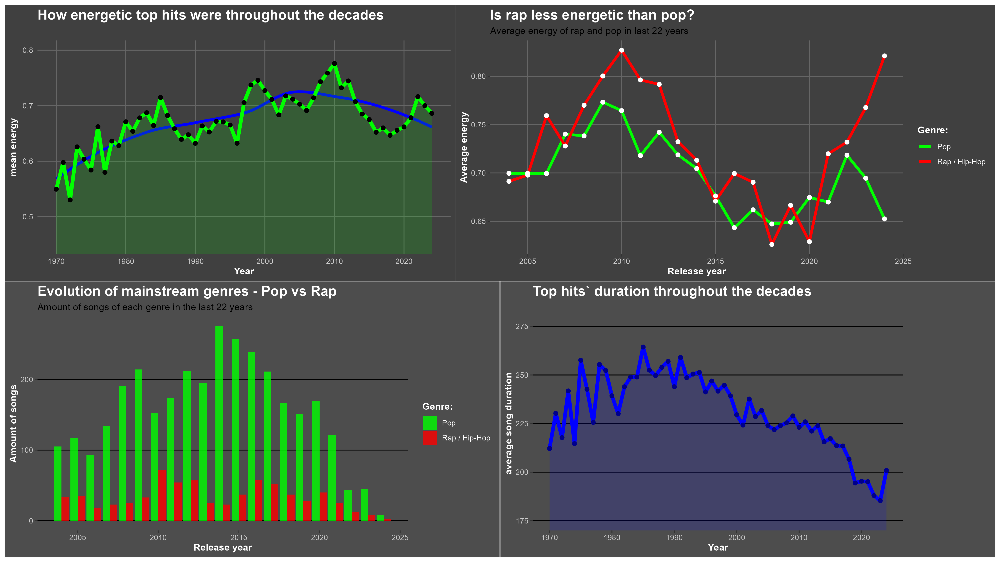

# Spotify Mainstream Evolution Analysis 

## Project Overview
This project analyzes 50 years of Spotify hits to investigate the evolution of music energy and track duration. Using **SQL** for data processing and **R** for visualization, I uncovered how streaming platforms have reshaped music production throughout the decades with special zoom on the 2010s.

## Key Insights
* **Energy Decline:** A significant downward trend in song energy has been observed since 2010 across all mainstream genres.
* **Song Duration Decline:** Average track duration decreased by ~40 seconds over the last decade to optimize for short form content algorithms.
* **Genre Dynamics:** Disproved the myth that Rap alone is responsible for the "chill" shift in music; the trend is industry-wide.

## Final Dashboard

## Full Technical Report
👉 [**Click here to view the full interactive HTML report**](https://github.com/makshala43-maker/Billboard-200-hits-analysis/blob/main/spotify_markdown.html)

## Technologies Used
* **SQL (BigQuery):**
* **R (Tidyverse, ggplot2):** 
* **R Markdown:** 
